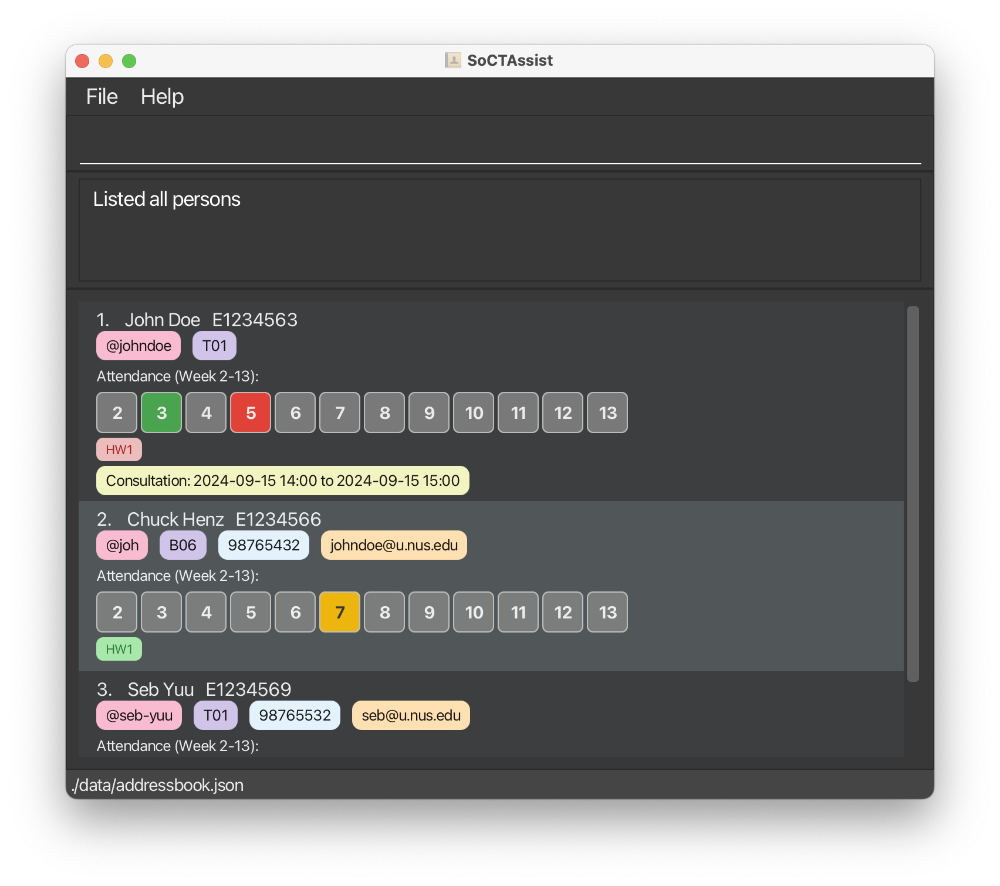
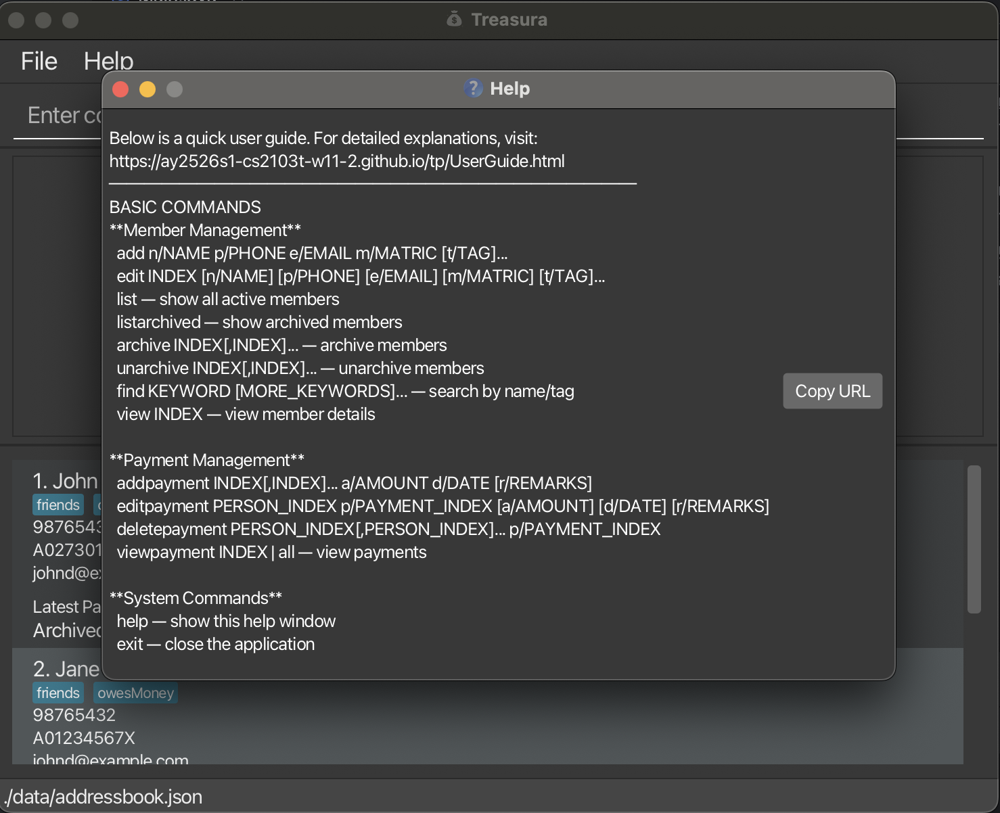

# Treasura User Guide

**Treasura** is a **desktop app** designed for **NUS student club treasurers** to efficiently **manage member information** and **track payments**.  
It is optimized for **fast, keyboard-based input** through a **Command Line Interface (CLI)**, while still offering the convenience of a **Graphical User Interface (GUI)**.

With Treasura, you can handle **contact management** and **payment tracking** **faster and more accurately** than with traditional **spreadsheet** or **form-based systems**.

<!-- * Table of Contents -->
<page-nav-print />

--------------------------------------------------------------------------------------------------------------------

## Quick start

1. Ensure you have Java `17` or above installed in your Computer. 
   **Mac users:** Ensure you have the precise JDK version prescribed [here](https://se-education.org/guides/tutorials/javaInstallationMac.html).

1. Download the latest `.jar` file from [here](https://github.com/se-edu/addressbook-level3/releases).

1. Copy the file to the folder you want to use as the _home folder_ for your Treasura.

1. Open a command terminal, `cd` into the folder you put the jar file in, and use the `java -jar addressbook.jar` command to run the application. 
   A GUI similar to the below should appear in a few seconds. Note how the app contains some sample data. 
   

5. **Start using Treasura**  
   Type commands into the command box and press **Enter** to execute them.  
   For example, typing `help` and pressing Enter opens the help window.

---

### Example Commands to Try

### Suggested First Steps

1. Use `list` to view the sample members.
2. Try `add` to add your own club member.
3. Record a payment with `addpayment`.
4. Archive inactive members with `archive` and view them later using `listarchived`.
5. When done, type `exit` to close Treasura — all data is automatically saved.

| Command | Description | Example |
|----------|--------------|---------|
| `list` | Lists all active members | `list` |
| `add` | Adds a new member | `add n/John Doe m/A0123456X p/98765432 e/john@example.com t/exco` |
| `addpayment` | Records a payment for a member | `addpayment 1 a/50.00 r/Club fees d/2025-10-26` |
| `viewpayment` | Displays all payments made by a member | `viewpayment 1` |
| `archive` | Archives a member | `archive 1` |
| `listarchived` | Lists all archived members | `listarchived` |
| `unarchive` | Restores a member from the archived list | `unarchive 1` |
| `exit` | Exits the app | `exit` |

Refer to the [Features](#features) below for details of more commands.

--------------------------------------------------------------------------------------------------------------------

## Features

<box type="info" seamless>

**Notes about the command format:** 

* Words in `UPPER_CASE` are the parameters to be supplied by the user. 
  e.g. in `add n/NAME`, `NAME` is a parameter which can be used as `add n/John Doe`.

* Items in square brackets are optional. 
  e.g `n/NAME [t/TAG]` can be used as `n/John Doe t/friend` or as `n/John Doe`.

* Items with `…`​ after them can be used multiple times including zero times. 
  e.g. `[t/TAG]…​` can be used as ` ` (i.e. 0 times), `t/friend`, `t/friend t/family` etc.

* Parameters can be in any order. 
  e.g. if the command specifies `n/NAME p/PHONE_NUMBER`, `p/PHONE_NUMBER n/NAME` is also acceptable.

* Extraneous parameters for commands that do not take in parameters (such as `help`, `list`, `exit`) will be ignored. 
  e.g. if the command specifies `help 123`, it will be interpreted as `help`.

* If you are using a PDF version of this document, be careful when copying and pasting commands that span multiple lines as space characters surrounding line-breaks may be omitted when copied over to the application.
</box>

### Viewing help : `help`

Shows a message explaining how to access the help page.

Format: `help`

## 🧍 Member Management

### Adding a Member: `add`
Adds a new member to Treasura.

**Format:**  
`add n/NAME m/MATRICULATION_NUMBER p/PHONE_NUMBER e/EMAIL [t/TAG]…​`

> **Notes:**
> - Each **Matriculation Number must be unique**.
> - Must follow **NUS format**: `A` + 7 digits + uppercase letter (e.g., `A0123456X`).
> - Tags are optional and can be used for roles (e.g., `exco`, `performer`).

**Examples:**
- `add n/John Doe m/A0123456X p/98765432 e/john@example.com`
- `add n/Betsy Crowe m/A0234567Y p/91234567 e/betsy@example.com t/exco t/publicity`

---

### Listing All Members: `list`
Displays all active members.

**Format:**  
`list`

---

### Finding Members: `find`
Finds members whose names contain the given keywords.

**Format:**  
`find KEYWORD [MORE_KEYWORDS]`

> - Search is **case-insensitive** and matches **whole words only**.
> - Members matching **any** of the keywords are listed (OR search).

**Examples:**
- `find John` — finds all members named John.
- `find alex david` — finds members named Alex or David.

---

### Editing a Member: `edit`
Edits details of an existing member.

**Format:**  
`edit INDEX [n/NAME] [m/MATRICULATION_NUMBER] [p/PHONE_NUMBER] [e/EMAIL] [t/TAG]…​`

> - **INDEX** refers to the member’s number in the displayed list.
> - At least one field must be provided.
> - Editing tags replaces all existing tags. Use `t/` to remove all tags.
> - Updated Matriculation Numbers must remain **unique** and **NUS-formatted**.

**Examples:**
- `edit 1 p/91234567 e/johndoe@example.com`
- `edit 2 n/Betsy Crower t/`
- `edit 3 m/A0987654Z`

---

### Archiving a Member: `archive`
Archives a member, hiding them from the active list but keeping their records.

**Format:**  
`archive INDEX`

**Examples:**
- `archive 1` — archives the 1st member.
- `archive 3` — archives the 3rd member.

---

### Listing Archived Members: `listarchived`
Displays all archived members.

**Format:**  
`listarchived`

**Example:**
- `listarchived` — lists all archived members.

---

### Unarchiving a Member: `unarchive`
Restores an archived member to the active list.

**Format:**  
`unarchive INDEX`

> - Run `listarchived` first to view indices of archived members.
> - Restored members retain all previous details and payments.

**Examples:**
- `unarchive 1` — restores the 1st archived member.
- `unarchive 2` — restores the 2nd archived member.

---

## 💰 Payment Management

### Adding a Payment: `addpayment`
Adds a payment record to a member.

**Format:**  
`addpayment INDEX a/AMOUNT r/REMARK d/DATE`

> - **AMOUNT** must be numeric, up to 2 decimal places.
> - **DATE** must follow `YYYY-MM-DD`.

**Examples:**
- `addpayment 1 a/50.00 r/Club fees d/2025-10-26`
- `addpayment 2 a/25.50 r/Dance costume fee d/2025-03-15`

---

### Editing a Payment: `editpayment`
Edits details of an existing payment.

**Format:**  
`editpayment MEMBER_INDEX p/PAYMENT_INDEX [a/AMOUNT] [r/REMARK] [d/DATE]`

> - Both indices must be **positive integers**.
> - You can edit one or more fields.

**Examples:**
- `editpayment 1 p/2 a/75.00` — updates the 2nd payment of member 1.
- `editpayment 3 p/1 r/Orientation fee` — edits the remark of the 1st payment of member 3.

---

### Viewing All Payments: `viewpayment`
Displays all payments made by a specific member.

**Format:**  
`viewpayment INDEX`

**Examples:**
- `viewpayment 1` — shows all payments made by the 1st member.
- `viewpayment 2` — shows payments of the 2nd member.

---

### Finding Payments: `findpayment`
Finds payments made by a specific member using filters.

**Format:**  
`findpayment INDEX [a/AMOUNT] [r/REMARK] [d/DATE]`

> - Search within a member’s payment history.
> - Combine filters to narrow results.

**Examples:**
- `findpayment 1 a/50.00`
- `findpayment 2 r/Workshop`
- `findpayment 3 d/2025-03-15`

---

### Deleting a Payment: `deletepayment`
Removes a specific payment record from a member.

**Format:**  
`deletepayment MEMBER_INDEX p/PAYMENT_INDEX`

> - Once deleted, the payment cannot be recovered.

**Examples:**
- `deletepayment 1 p/1` — deletes the 1st payment of member 1.
- `deletepayment 2 p/3` — deletes the 3rd payment of member 2.

---

## ⚙️ General Commands

### Exiting the Program: `exit`
Closes Treasura.

**Format:**  
`exit`

---

**Tip:**  
For best results, always run `list` or `listarchived` before executing commands that use an **INDEX**.

### Saving the data

AddressBook data are saved in the hard disk automatically after any command that changes the data. There is no need to save manually.

### Editing the data file

AddressBook data are saved automatically as a JSON file `[JAR file location]/data/addressbook.json`. Advanced users are welcome to update data directly by editing that data file.

<box type="warning" seamless>

**Caution:**
If your changes to the data file makes its format invalid, AddressBook will discard all data and start with an empty data file at the next run.  Hence, it is recommended to take a backup of the file before editing it. 
Furthermore, certain edits can cause the AddressBook to behave in unexpected ways (e.g., if a value entered is outside the acceptable range). Therefore, edit the data file only if you are confident that you can update it correctly.
</box>

### Archiving data files `[coming in v2.0]`

_Details coming soon ..._

--------------------------------------------------------------------------------------------------------------------

## FAQ

**Q**: How do I transfer my data to another Computer? 
**A**: Install the app in the other computer and overwrite the empty data file it creates with the file that contains the data of your previous AddressBook home folder.

--------------------------------------------------------------------------------------------------------------------

## Known issues

1. **When using multiple screens**, if you move the application to a secondary screen, and later switch to using only the primary screen, the GUI will open off-screen. The remedy is to delete the `preferences.json` file created by the application before running the application again.
2. **If you minimize the Help Window** and then run the `help` command (or use the `Help` menu, or the keyboard shortcut `F1`) again, the original Help Window will remain minimized, and no new Help Window will appear. The remedy is to manually restore the minimized Help Window.

--------------------------------------------------------------------------------------------------------------------

## Command Summary

| **Action** | **Format & Examples** |
|-------------|------------------------|
| **Add a Member** | `add n/NAME m/MATRICULATION_NUMBER p/PHONE_NUMBER e/EMAIL [t/TAG]…` e.g. `add n/John Doe m/A0123456X p/98765432 e/john@example.com t/exco` |
| **List All Members** | `list` |
| **Find Members** | `find KEYWORD [MORE_KEYWORDS]` e.g. `find John` |
| **Edit Member Details** | `edit INDEX [n/NAME] [m/MATRICULATION_NUMBER] [p/PHONE_NUMBER] [e/EMAIL] [t/TAG]…` e.g. `edit 1 p/91234567 e/johndoe@example.com` |
| **Archive Member** | `archive INDEX` e.g. `archive 1` |
| **List Archived Members** | `listarchived` |
| **Unarchive Member** | `unarchive INDEX` _(Run `listarchived` first to check indices.)_ e.g. `unarchive 1` |
| **Add Payment** | `addpayment INDEX a/AMOUNT r/REMARK d/DATE` e.g. `addpayment 1 a/50.00 r/Club fees d/2025-10-26` |
| **Edit Payment** | `editpayment MEMBER_INDEX p/PAYMENT_INDEX [a/AMOUNT] [r/REMARK] [d/DATE]` e.g. `editpayment 1 p/2 a/75.00` |
| **View Payments** | `viewpayment INDEX` e.g. `viewpayment 1` |
| **Find Payments** | `findpayment INDEX [a/AMOUNT] [r/REMARK] [d/DATE]` e.g. `findpayment 1 r/Workshop` |
| **Delete Payment** | `deletepayment MEMBER_INDEX p/PAYMENT_INDEX` e.g. `deletepayment 2 p/3` |
| **Show Help Window** | `help` |
| **Exit Treasura** | `exit` |
